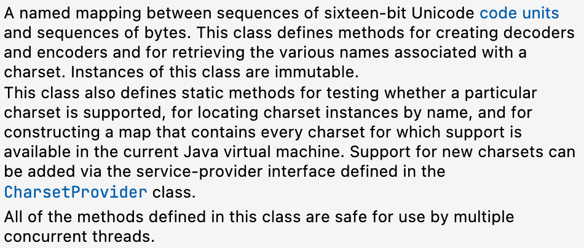
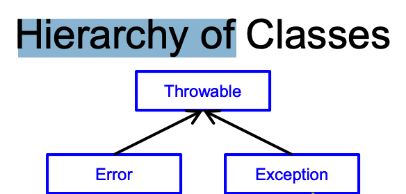
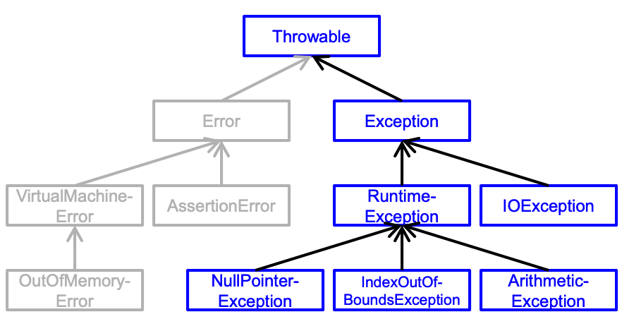
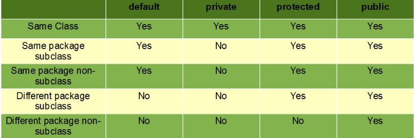

# Final Review

## Java Interface

### Interface may be used to define:

- instance methods
- static final variables
  -  it is unusual for an interface to define variables
- No constructors
- no static methods
- no instance variables

### Core interface  (kernel)

Its our kernel interface

- – The mathematical model for the type
-  – Contract(s) for the constructor(s)
-  – Contract(s) for kernel methods
-  – Contract(s) for methods inherited from Java library interfaces that do not have their own contract specifications (if applicable; e.g., an iterator or a comparator)
- The enhanced interface defines contracts for all other methods for the type

### Kernel interface design guidelines

Kernel methods generally should be:

- A minimal set of methods that is functionally complete, i.e., powerful enough to:
  - Give a variable of the type any allowable value
  - Determine the value of a variable of the type
- Powerful enough to allow a client to:
  -  Implement equals and toString
  -  Check every kernel method’s precondition

### Enhance interface

most powerful interface

### Notice there is Circularity 


Java permit the circularity because

1. Java **interface** define as **type**, i.e., the type name along with the set of its instance methods
2. An interface type may be used in Java **even if there is no implementation** of it in scope

Interfaces are a compile-time construct

- – Used by the Java compiler for type-checking with declared types: to make sure variables are used only where they make sense • 
  - Recall the rules for declared types and object (dynamic) types 
    - The declared type of a variable may be an interface type 
    - The object type can never be an interface type, because you may not instantiate a variable using new followed by an interface type
    - If the declared type is an interface type, then the object type (a class) must implement the declared type (an interface
- – Once a Java program compiles, only object types are kept at run-time 
  - • Declared types literally “disappear” in the JVM

### Packages

Each OSU CSE component family is bundled into its own package, i.e., a grouping of interfaces and classes that the designer thinks “belong together” for logical reasons

 – Example: the Queue-family components are all in the package components.queue

A package provides:

1. – Logical structuring: packages are hierarchical, i.e., you may have packages within packages
2. A namespace: units in different packages may have the same name without conflict • See also import statements
3. Another level of access control between public and private

## Object class method

### Common Method from **Object**

Eevery Java class implicitly extends the class Object, which defines the following methods and provides default implementations that you should override: 

- boolean equals(Object obj)
- int hashCode() 
- String toString()

### Default implmentation of equals, hashCode ,and toString

1. equals 
   1. Default implementation of equals: “for any non-null reference values x and y, this method [i.e., x.equals(y)] returns true if and only if x and y refer to the same object (x == y has the value true).”
2. hashCode
   1. “typically implemented by converting the internal address of the object into an integer, but this implementation technique is not required by the JavaTM programming language
3. toString
   1. Default implementation of toString: “returns a string consisting of the name of the class of which the object is an instance, the at-sign character '@', and the unsigned hexadecimal representation of the hash code of the object.”

Object cannot possibly know anything about the abstract mathematical model values (i.e., the object values) of variables

### The Crux of the Problem

- Object cannot possibly know anything about the **abstract mathematical model values** (i.e., the object values) of variables
  - which means the equal method compare reference value , maybe its not what the developer wants to compare with.
  - equals, hashCode, and toString should all behave in ways that depend on these abstract mathematical model values

### Way Implementation equals, hashCode ,and toString

1. equals

   1. There are a couple ways to approach this, but best practice suggests a multi-step “filtering” approach that first **weeds out special cases**

      1. If the reference values of obj and this are equal 

      2. : If obj is null, then its object value does not equal the object value of this.

      3. If the types of obj and this are not the same, then their object values are not equal

         1. Java gives us a way to check a slightly more general interpretation of “types are not the same”, which is better for this purpose than checking whether dynamic types are the same

            instanceof Operator helps check the dynamic type

### Steps to implements equal method 

There are a couple ways to approach this, but best practice suggests a multi-step “**filtering**” approach that first weeds out special cases

1. Step1: if the Reference value of Object obj and this are equal, then return true
2. Step2: if the obj is null then it's object value is not equal to this, then return false
3. Step3: if the type of obj and this are not same, then they are not equal
   1. using instance of to check
      1. how about collections? wo we have to use raw type, every type erasure will become object class type

### Type Erasure

For generic types, the JVM keeps track of the raw type (e.g., Queue1L or Queue2) of each variable as its dynamic type, but does not keep track of any generic type parameters (e.g., for this variable T is Integer, for that variable T is String)

This mechanism is called type erasure – Effectively (but not technically), the type parameter is replaced by Object

```
if (!(obj instanceof XYZ<?>))
//This checks whether obj has a dynamic type that implements “XYZ of unknown”, which is all the JVM knows about.
```

```
//Step 1
if (obj == this) {
return true;
}
//Step 2
if (obj == null) {
return false;
}
//Step 3
if (!(obj instanceof XYZ<?>)) {
return false;
}
//Now it's time to casting
XYZ<?> x = (XYZ<?>) obj; //we limit ourselves to using XYZKernel methods to determine whether their mathematical model values are equal.
```

### Two Remaining Problems

1. What if the loop doesn’t execute at all because q and this are both empty (but with different entry types)?
   1. There is no apparent way around this in Java!
2. What happens with an “unordered” math model type, e.g., Set or Map?
   1. – A slightly bigger mess, but it can be handled

##  Java Collections Framework

### Views in the JCF

Views for Map: 

- – Keys: Set<T> keySet()
-  – Values: Collection <T> values() 
- – Pairs: Set<Map.Entry<K,V>> entrySet()

### View "Backed By" Collection

A view is **backed by the underlying** collection, which means that **if the view is modified** then the underlying (“backing”) **collection is also modified**, and vice versa

### Could remove Cause Trouble?

Could the optional remove method **not be supported** by the object type of m.values()?

Yes! **BUT**

- Yes! But only when the backing Map does not support remove(). Otherwise, it is supported because the informal Javadoc for the values method says: “The collection supports element removal, which removes the corresponding mapping from the map, via the Iterator.remove, Collection.remove, removeAll, retainAll and clear operations. It does not support the add or addAll operations
- Which means the remove method come from 

## Using Iterators

### JCF Iterator Rule

When **iterating over** a **collection** with an iterator (explicitly or implicitly with a for‐each loop), **do not call any methods on the collection** and **do not change the value of any of the elements** of the collection (or the collection itself)

​	The behavior of an iterator is unspecified if the underlying collection is modified while the iteration is in progress in any way other than by calling the iterator’s remove method.

## Java Input/Output

### I/O Streams

- An **input/output stream** is a (conceptually not necessarily finite) series of data items
    - An **input stream** is a “flow” of data items from a **source** to a program
        - The program **reads** from the source (or from the stream)

- An **output stream** is a “flow” of data items from a program to a destination
    - The program **writes** to the destination (or to the stream)

### Input Streams

Note:**Source** may be the **keyboard**, a file on disk, **a physical device**, **another program**, even an **array** or **String** in the same program.

### Output Streams

**Destination** may be the **console window**, **a file** on disk, a physical device, another program, even an array or **String** in the same program.


### Input with keyboard

```java
public static void main(String[] args) throws IOException {
    BufferedReader input = new BufferedReader(new InputStreamReader(System.in));
    String s = input.readLine();
    ...
    input.close();
}

```

At this point, we want to using the keyboard input be source, but the, System.in is a **byte stream**, so we have to **wrap** it.

At same time, method in java.io throw exception under certain circumstancesstances, and you need **catch** them

​	either throw exception in the **method header** or **using try-catch**

**InputStreamReader**

- An InputStreamReader is  bridge **from byte streams to character streams** It reads bytes and decodes them into characters using a specified charset (talk later). 

    - So it wrap System.in(a byte input stream) into a **char stream reader (char input stream)**

    

**BufferedReader**

- An BufferedReader **reads text from a character-input stream**, buffering characters so as to provide for the efficient reading of characters, arrays, and lines.

That's why we need three different class here.... so messssssss

```java
new BufferedReader(new InputStreamReader(System.in))
```

This technique of slightly extending features or **capabilities of an object** by **wrapping** it **inside** **another object** is a popular object-oriented design pattern called the **decorator pattern.**

### An Alternative input with keyboard

using the Class from `java.util.Scanner`

e.g

```java
public static void main(String[] args) {
    Scanner input = new Scanner(System.in);
    String s = input.nextLine();
    ...
    input.close();
}
```

Note: the wraping Class to help people read from keyboard, mention that method already wrapped for u so call readLine() instead call nextLine()

### Input from File

```java
public static void main(String[] args) throws IOException {
    BufferedReader input = new BufferedReader(new FileReader("data/test.txt"));
    String s = input.readLine();
    ...
    input.close();
}
```

### Console Output

Ez to show

`System.out.println("Hello world")`

### File Output (java.io)

```java
public static void main(String[] args) throws IOException {
  
PrintWriter output = new PrintWriter(new BufferedWriter (new FileWriter("data/test.txt")));
output.print("foo");
output.println(" and bar");
...
output.close();
}
```

- **FileWriter**

    - FileWriter is used to writes text to character files using a default buffer size
    - **FileWriter is meant for writing streams of characters** 
        - It's a **character output stream** (Talk about later what's the diff between char stream and byte stream)

- **BufferedWriter**

    - An BufferedWriter **writes text to a character-output stream**, buffering characters so as to provide for the efficient writing of single characters, arrays, and strings.
        - It's a text output stream

- **PrintWriter**

    - An PrintWriter **prints formatted representations** of objects **to** a text-output stream

    - For the foramtted, that's why we want to use PrintWriter

    - It's disgusting to directly using the method form BufferedWritter, we need some util format method! which come from PrintWriter

    - (not from this course)Note: ofc you can directly use the BufferedWriter, but remember to close writer

        ```java
        BufferedWriter writer = new BufferedWriter(new FileWriter("asdasd.txt"));
        writer.write("Hello World");
        writer.close();
        ```

        It's **inconvient** to directly using BufferedWriter to wrap line :( 

### IOException

#### A number of java.io constructors and methods might throw (raise) an IOException

Examples:

​	files to be used as sources destinations may not exist  may not be readable and/or writeable by the user of the program etc.

### Standard Stream

The utility class System in java.lang declares three standard streams:

- System.in
- System.out
- System.err

You do not declare, open, or close these streams; but you can always use them without worrying about exceptions (Java already declare for you)

### Byte and Character Streams

note: I don't think they gonna let u write code about byte stream

Java has two categories of streams:

- Byte streams are streams of 8-bit bytes 
    -  This is a kind of low-level I/O that you rarely need
- Character streams are streams of Unicode characters
    - This is preferred for text I/O because it accounts for the “local” character set and supports **internationalization** with little additional effort

Note : **Best practice** is to use character streams with textual I/O

### Buffered Streams

Buffered streams **minimize** **disk access** for reading/writing files, and generally have **performance** **advantages** over unbuffered streams

Best practice is to “wrap” input and output character streams to create buffered versions

I already show how it works and java standard description above

### Files and Paths

The File class (an original part of Java) and the Path interface (new in Java 1.7) allow you to manipulate directories and files and the “paths” to them in the file system, e.g.:

- Check file existence and permissions, create files and set permissions, delete files, etc

Note: just take a look 

## Java Loose Ends

Few Java issues introduced earlier deserve a more in-depth treatment:

-   – Try-Catch and Exceptions 
-   – Members (static vs. instance)
-    – Nested interfaces and classes
-    – Access modifiers – “Final”

### Exceptions

An exception indicates a **problem** with an application that **entails** (in Java) **a dramatic change of control flow**

Vocabulary: Exceptions (and Errors) are

-   “thrown” by a component implementation
-   “caught” by a client

### Syntax of Try-Catch

just `try{}catch(SOME_EXCEPTION e) {}` the ez one

you can keep catch different exception, e.g. 

```java
try {
		statements
} catch(exceptionType1 identifier1) {
		handler for type1
} catch(exceptionType2 identifier2) {
		handler for type2
}
```

 If **nothing** is thrown during execution of the statements in the try block, try block finishes successfully and catch block will ignored, then the program keep going

if something is thrown exception:

1.   the rest of try block code is skipped
2.   The catch clauses are **examined** **top to bottom** for the first **matching catch**
3.   If an appropriate catch clause is found: 
     1.    The body of the catch clause is executed
     2.   The remaining catch clauses are skipped
4.   If no such catch clause is found:
     1.   The exception is thrown to the **outer block**, which is either
          1.   A try block (that potentially handles it, in the same manner)	
          2.   A method body (resulting in it being thrown to its client)

**Best practice** suggests exceptions should be **reserved for unexpected** situations:

-   Problems external to the application
    -   there is a hardware problem with a disk drive
-   Resource exhaustion
    -   (out of memo)
-   Problems that cannot be handled with checkable preconditions in contracts
    -   Example: a file does not exist—because it has been deleted after its existence has already been “confirmed”.

### Hierarchy of Theowable 

The diagram of Throwable

###  

The **Throwable** class is the **superclass** of **all errors and exceptions in the Java language**. Only objects that are instances of this class (or one of its subclasses) are thrown by the Java Virtual Machine or can be thrown by the Java throw statement.

### Unrecoverble and recoverble error

Note: An **unrecoverable** error is a type of error that **cannot be fixed** or resolved. This means that the **system or program encountering the error** will be unable to continue functioning properly, and may need to be restarted or shut down completely. A **recoverable** error, on the other hand, **is an error that can be fixed** or resolved **without disrupting the operation of the system or program.** In most cases, a recoverable error will allow the system or program to continue running, but it may require some corrective action on the part of the user or the system itself to fix the problem.

**In OSU**

“**Unrecoverable**”: hardware, JVM, or application error (e.g., “out of memory)

​	You have to restart computer or change ur hardware

“**Recoverable**”: application problem (e.g., “file not found”)

​	You can just reenter the file address

### **Few Error and exception**



### Unchecked vs. Checked

-   **Unchecked** exceptions are:

    -   – **Error** and its subclasses
    -   **RuntimeException** and its subclasses

-   The rest are **checked** exceptions

    -   “Checked” means that the compiler checks that a method whose body contains a statement that might throw the exception either **catches** it, or explicitly “propagates it up the call chain” by declaring that it also **throws** the exception

        **For example:** if you using **BufferedReader**, you have **either** **catch** or **throws**, because BufferedReader may cause IOException

### Members

A class may have different kinds of members:

1.   Variables/fields/data members
2.   Constructors
3.   Methods 
4.   Nested classes

 All except constructors may be either **static members** or **instance members*

Note: **static members** of  a class also call **class members**(There are a lot different way to call it, just do whatever you want, **static field** or **static variable,** or just **static members**, or just **class members**)

### Static vs. Instance Variables

 the static method or static member's value are share to current program when it running 

Here is the OSU explain:

-   At run-time, a Java program has separate representations for:
    -   All **static variables** for each **class** C
    -   All instance variables for each **instance** of C, i.e., for each object with dynamic type C
-   Bytecode for C constructors, methods, and nested classes is part of the run-time representation of class C

### Static Initialization Blocks

To initialize static variables in a class, you may write a static initialization block that looks like this:

```java
static {
	// Code to initialize static variables
}
```

This code is automatically executed when the **class is loaded**, i.e., once at the very beginning of program execution

Note: as I said, "it will initial **at the start of the execution**"

### Nested Interfaces

An interface may be nested within another interface

-   Example (from OSU CSE components)
    -   Map.Pair<K,V>
    -   Map.Entry<K,V>

### Nested Classes

A class that is nested as a member of another class may be:

-   A static nested class

    -   A static nested class **does not have access** to instance members of its enclosing class
        -   Effectively, it’s a top-level class declared inside another class since it “logically belongs”
        -    Example (from OSU CSE components): MapSecondary.SimplePair
        -   Example (from Java libraries): AbstractMap.SimpleEntry<K,V>
-   An **instance nested class**, which is called an **inner class**

    -   the Node we written before, right?
    -   Each instance of an inner class belongs to an instance of its enclosing class
    -   Has access to generic parameters, variables, methods, etc., of its enclosing instance
    -   Examples (from OSU CSE components): 
    
        -   Stack2.Node
    -   Stack2.Stack2Iterator


### Access Modifiers

There are **four access modifiers** in Java

-   public 
    -   (Only public and “package private” apply to top-level units declare interface and classes, interface members can be public (the default) or private (not used in OSU components); class members can be any of the four.)
        -   Note: for the member, we talking about **variable** rather than method.
    -   A **top-level unit** declared **public** is **accessible** from **anywhere**
    -   A **member** declared **public** is **accessible** from **anywhere too**
        -   So long as the top-level unit it’s in is also accessible, which henceforth goes without saying
-   protected
    -   A top-level unit declared without any access modifier is **accessible** from **anywhere** **within the same package**
        -   The `protected` keyword is an access modifier used for attributes, methods and constructors, making them accessible in the same package and subclasses.
    -   A class member declared without any access modifier is **accessible** from a**nywhere within the same package**
        -   Everyone could change it into same pack by adding this as its first line by : package NAME; ()
-   default(package private)
-   privarte
    -   A class (or interface) member declared private is **accessible** **only** from within the class (or interface) **containing** the **private member**
    -   **Best practice** is to make all members in **interfaces** **public** and all **static and instance variables in classes private**, and to offer public methods with which clients may indirectly manipulate their values
    -   **An exception**: **constants**, which are normally public static final variables 



### Final

-   A class declared final may not be extended 
-   A method declared final may not be overridden 
-   A variable declared final may not be modified once it is given a value
    -   Which is why it is often called a “constant” 
        -   Be careful! For **a reference variable** (or parameter): the **reference value** **cannot** be **modified**, but the **object value can be modified**
-   A formal parameter declared final may not be modified inside the method
