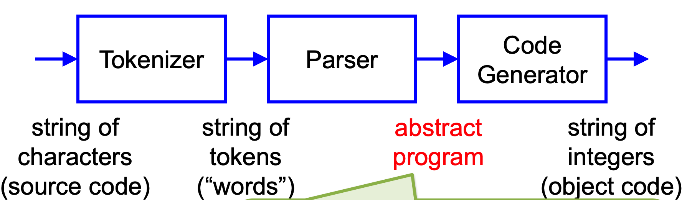
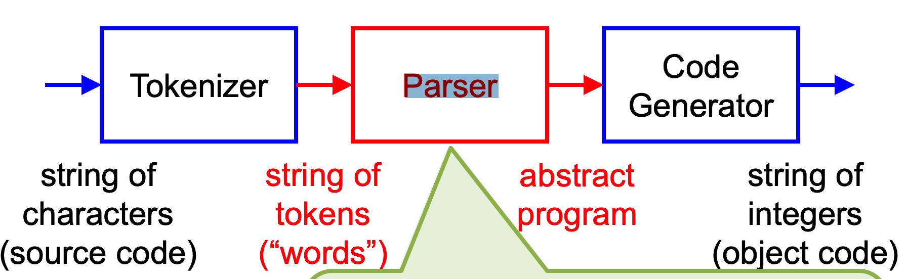
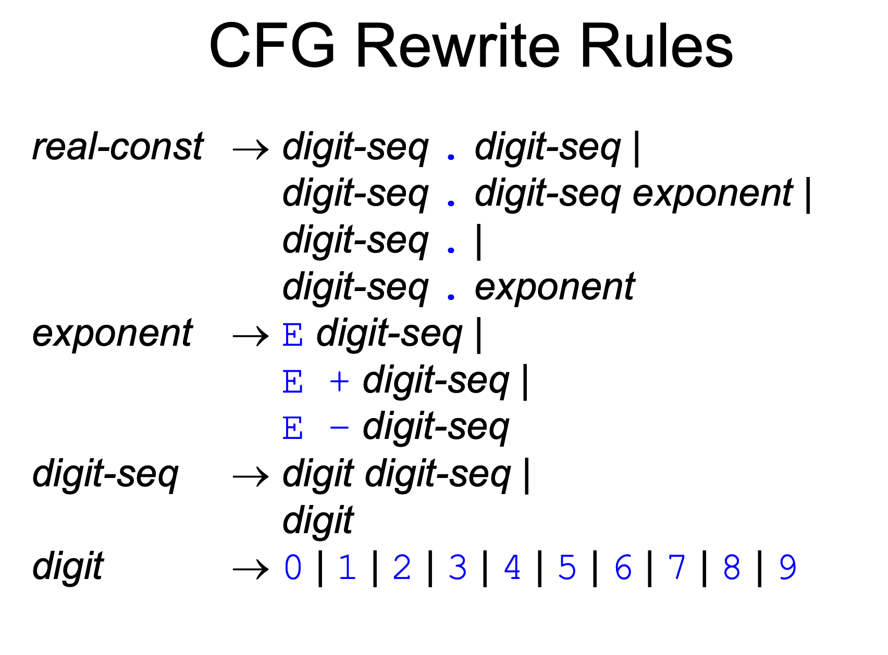
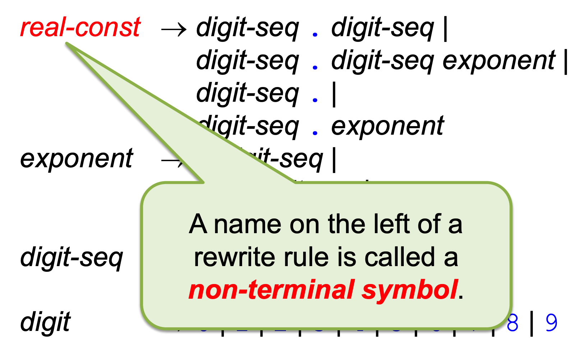
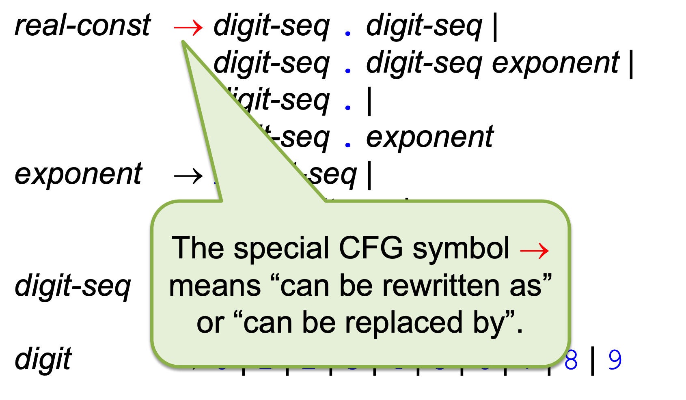
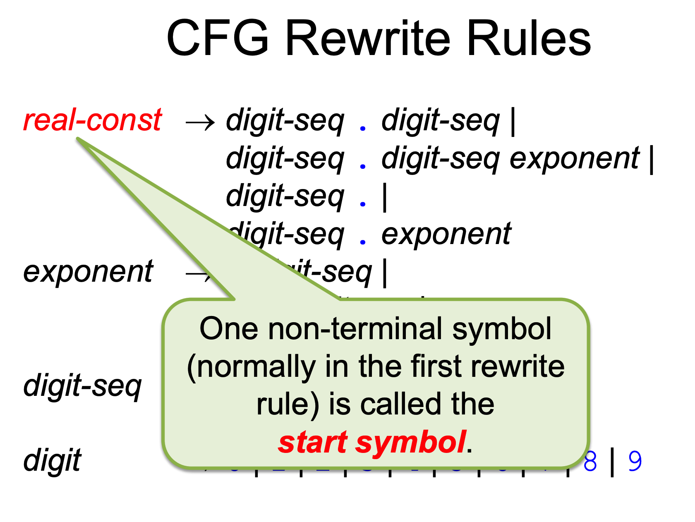
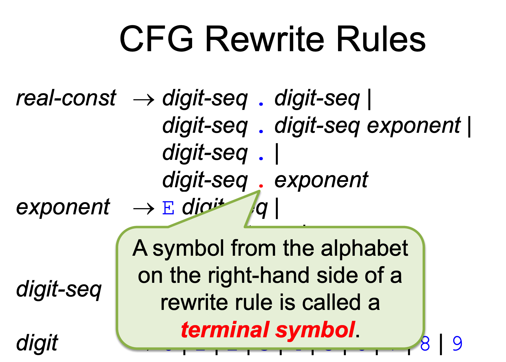
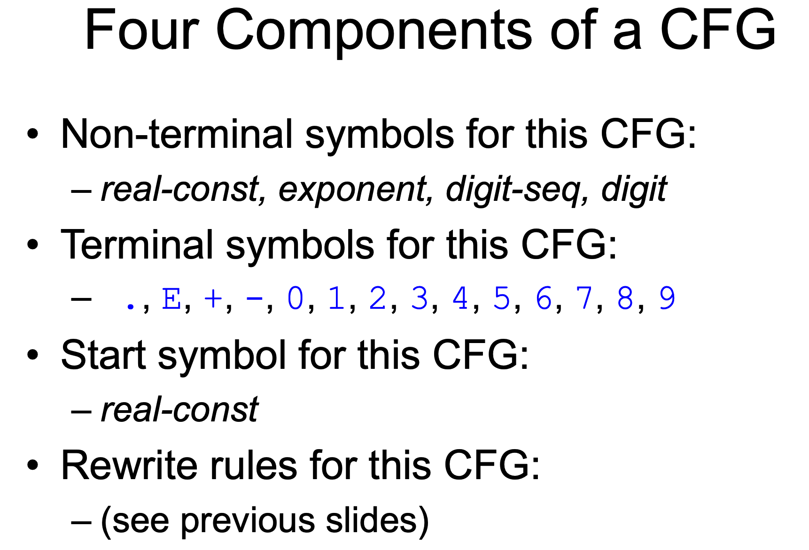
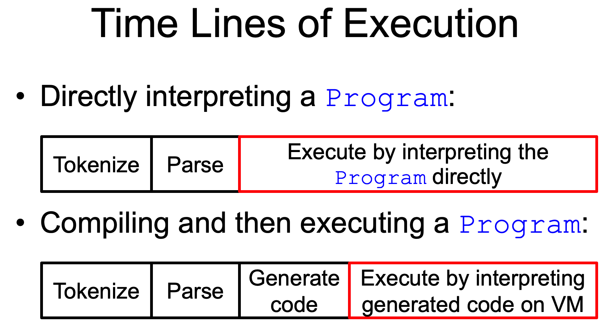
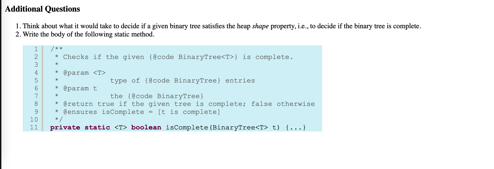

# CSE2231 Midterm 2

| Type                  | Mathematical type   | Description                                                  |
| --------------------- | ------------------- | :----------------------------------------------------------- |
| Heap                  | inary tree of T     | it is a complete binary tree, the label in each node is “smaller than or equal to” the label in each of its child nodes |
| Tree                  | tree of t           | A tree can be thought of as a structure comprising zero or more nodes, each with a label of some mathematical type, say T, called the label type |
| Sequence\<Tree\<T\>\> | string of tree of T |                                                              |

Complete binary tree is all level except bottom level with any nodes on the bottom level **as far left** as possible

### OSU SortingMachine

A heap can be used to represent the values in a SortingMachine

- In **changeToExtractionMode**, arrange all the values **into** a heap
-  In removeFirst, remove the root, and adjust the slightly mutilated heap to make it a heap again
  - removeFirst property
    - If the root is the only node in the heap, then after removing it, what remains is already a heap; nothing left to do
    - If the root is not the only node, then removing it leaves an “**opening**” that must be filled by moving some other value in the heap into the opening
      - [siftdown the node][http://web.cse.ohio-state.edu/software/2231/web-sw2/extras/slides/14.Heaps-Heapsort.pdf]

## Linked Data Structures

### Singly-Linked Lists

#### Direct access

​	Direct access means the entries of a collection (typically with a string model) may be accessed by providing an int positis means the entries of a collection (typically with a string model) may be accessed by providing an int position/index of any entry in the collectionn/index of any entry in the collection – A classical but unfortunate synonym is random access; nothing random about it!

#### Sequential access

​	means the entries of a collection (with a string model) may be accessed in increasing order of position by accessing the “next” entry in the collection

### 

#### Dynamic Can Support Fast Sequential Access

- If we want a dynamic collection, then we should give up on storing all entries of the collection in contiguous memory locations
- If we want fast sequential access, then we should give up on fast direct access
  - – Instead, for every entry in the collection, wherever it is in memory, simply keep a reference to (i.e., memory location of) the “**next**” entry (How Singly linked list )

### The Smart Node(havent write yet)

​	To see why we want the extra node at the beginning of the linked list, write the code for enqueue without it (but be careful) – You should be able to see why it’s a smart node rather than a dummy node

Why is the smart node helpful in the representation of a Queue, but not of a Stack?

### Doubly-Linked Lists

## Standard Method

#### newInstance

Returns a new object with the same dynamic type as this, having an initial value. If the type TF has a no-argument constructor, then the value of the new returned object satisfies its contract. Otherwise, the value of the new returned object satisfies the contract of the constructor call that was used to initialize this

```java
@SuppressWarnings("unchecked")
```

This tells the compiler not to issue a warning about “unchecked conversion”

#### clear

Resets this to an initial value. If the type TF has a no-argument constructor, then this satisfies its contract. Otherwise, this satisfies the contract of the constructor call that was used to initialize #this.

#### transferFrom

we have to cast because we need to transfer everything from the source	

## Iterators

iterators offer a **special** way of getting **sequential access** to all elements/entries of a collection

Since List extends the interface Iterable, you may write a for-each loop to “see” all elements 

### boolean hasNext()

​	Returns true iff the iteration has more elements 

### T next()

​	Returns the next element in the iteration (i.e., the next “unseen” element, which becomes a “seen” element)

### void remove

​	The remove method is described as “optional” in the interface Iterator, and we do not “support” it because doing so can cause serious problems

## Mathematical Tree Notation

A tree (type tree of T) is either

- the empty tree (empty_tree), which has no nodes at all; or

- a non-empty tree, which consists of: • A root node (type T) • A string of the subtrees of the root (type string of tree of T)
- Since a non-empty tree may contain other trees (each of which may contain others), its structure is **recursive**

### Non-Empty Trees

Every non-empty tree is the result of the mathematical function compose applied to a value of the label type T and a string of tree of T, which are the root and the subtrees of the resulting tree

could have a lot of subtrees

//some formula in Tree class

## BugsWorld Intro

### Abstract Syntax Trees 

An abstract syntax tree (AST) is a tree model of an **entire program** or a certain “program structure” (e.g., a statement or an expression in a Java program)	

## BL Compiler Structure




## Statement 

### Statement Kernel Structure

The Statement component family allows you to manipulate values that are ASTs for BL statements

1. type StatementKernel -> type StatementKernel is modeled by STATEMENT_MODEL

   1. STATEMENT_MODEL -> STATEMENT_MODEL is tree of STATEMENT_LABEL

      ```
      STATEMENT_MODEL is tree of STATEMENT_LABEL
      exemplar s
      constraint
      |s| > 0 and
      [BLOCK can have 0 or more children, but
      not another BLOCK as a child] and
      [IF must have exactly one BLOCK child] and
      [IF_ELSE must have exactly two BLOCK
      children] and
      [WHILE must have exactly one BLOCK child] and
      [CALL must have no children (must be a leaf)]
      ```
      
      
      
      1. STATEMENT_LABEL -> 
      
         ```
         STATEMENT_LABEL is (
         kind: Kind,
         test: Condition,
         call: IDENTIFIER)
         exemplar sl
         constraint
         [if sl.kind = BLOCK then sl.test and sl.call are
         irrelevant] and
         [if sl.kind = IF or sl.kind = IF_ELSE or
         sl.kind = WHILE then sl.call is irrelevant] and
         [if sl.kind = CALL then sl.test is irrelevant]
         ```
      
         1. IDENTIFIER -> 
      
            ```
            IDENTIFIER is string of character
            exemplar id
            constraint
            [id starts with a letter 'a'-'z',
            'A'-'Z'] and
            [id contains only letters, digits
            '0'-'9', and '-'] and
            [id is not one of the keywords or
            conditions in the BL language]
            ```
      

## Program

The mathematical model of a Program includes that of a Statement (specifically, a BLOCK) for its body, 

plus more:

 – the program name

 – the new user-defined instructions, each of which also has a body

### ProgramKernel

type ProgramKernel is modeled by PROGRAM_MODEL

1. PROGRAM_MODEL ->

   ```
   PROGRAM_MODEL is (
   name: IDENTIFIER,
   context: CONTEXT,
   body: STATEMENT_MODEL
   )
   exemplar p
   constraint
   [p.body is a BLOCK statement]
   ```

   1. Context() comprises zero or more new instructions.

      ```
        CONTEXT is finite set of (
        name: IDENTIFIER,
        body: STATEMENT_MODEL)
        exemplar c
        constraint
        [the names of instructions in c are
        unique] and
        [the names of instructions in c do not
        match the names of primitive
        instructions in the BL language] and
        [the bodies of instructions in c are all
        BLOCK statements]
      ```


## Context-Free Grammars



### Grammar *(question ask prof)

A grammar is set of formation rules for string in language

A grammar is context-free if it satisfies certain technical conditions described herein. (what's that mean)

### Languages

A language is a set of strings over some alphabet **Σ**

If L is a language, then mathematically it is a set of string of Σ

### CFG symbol def













### Drivations

A derivation of a string of terminal symbols consists of a sequence of specific rewrite-rule applications that begin with the start symbol and continue until only terminal symbols remain

- The symbol ⇒ indicates a derivation step, i.e., a specific rewrite-rule application

E.g. of derivation

```
real-const  ⇒ digit-seq . digit-seq exponent
            ⇒ digit . digit-seq exponent
            ⇒ 5 . digit-seq exponent
            ⇒ 5 . digit exponent
            ⇒ 5 . 6 exponent
            ⇒ 5 . 6 E digit-seq
            ⇒ 5 . 6 E digit digit-seq
            ⇒ 5 . 6 E 1 digit-seq
            ⇒ 5 . 6 E 1 digit
            ⇒ 5 . 6 E 1 0
```

### Derivation Trees

- A derivation tree depicts a derivation (such as those above) in a tree • Note that the order in which rewrites are done is sometimes arbitrary
- A tree captures the required temporal order of rewrites from **top-to-bottom** 
- A tree captures the required spatial order **among terminal symbols from left-to-right**

## Tokenizing

In the examples of CFGs, we dealt with languages over the alphabet of individual characters

Now, we deal with languages over an alphabet of tokens, each of which is a unit that you want to consider as a single entity in the language

- **Choice of tokens is a design decision**

### Tokenizer's Job

The job of the tokenizer is to transform a string of characters into a string of tokens\

```
Input : "4 + (7 DIV 3) REM 5"
Output: <"4", "+", "(", "7", "DIV","3", ")", "REM", "5">

```

## Code Generation

last step of code compling

### Executing a BL Program

- There are two qualitatively different ways one might execute a BL program, given a value of type Program that has been constructed from BL source code: 
- Interpret the Program directly 
- Compile the Program into object code (“byte code”) that is executed by a virtual machine

#### Time Lines of Execution



### Code Generation

- Code generation is translating a Program to a linear (non-nested) structure, i.e., to a string of low-level instructions or “byte codes” of a BL virtual machine that can do the following:
  -  Update the state of BugsWorld 
  - “Jump around” in the string to execute the right “byte codes” under the right conditions, depending on the state of BugsWorld

#### BugsWorld Virtual Machine

The virtual machine for BugsWorld has three main features:

- Memory 

  - **A string of integers** that contains the “byte codes” generated from a Program

- Instruction set 

  - A **finite set of integers** that are the “byte codes” for the primitive instructions of the BugsWorld VM

  - Each instruction is given a **symbolic name *here***, for **ease of reading**, but the **VM** knows **only** about integer “byte codes”

  - for code generation has two types of instructions:

    - Primitive instructions

      ```
      • MOVE (0)
      • TURNLEFT (1)
      • TURNRIGHT (2)
      • INFECT (3)
      • SKIP (4)
      • HALT (5)
      ```

    - Jump instructions

      ```
      • JUMP (6)
      --This unconditional jump instruction causes the program counter to be set to the value in the memory location following the JUMP code.
      • JUMP_IF_NOT_NEXT_IS_EMPTY (7)
      • JUMP_IF_NOT_NEXT_IS_NOT_EMPTY (8)
      • JUMP_IF_NOT_NEXT_IS_WALL (9)
      --This conditional jump instruction causes the program counter to be set to the value in the memory location following the instruction code iff it is not the case that the cell in front of the bug is a wall.
      • JUMP_IF_NOT_NEXT_IS_NOT_WALL (10)
      • JUMP_IF_NOT_NEXT_IS_FRIEND (11)
      • JUMP_IF_NOT_NEXT_IS_NOT_FRIEND (12)
      • JUMP_IF_NOT_NEXT_IS_ENEMY (13)
      • JUMP_IF_NOT_NEXT_IS_NOT_ENEMY (14)
      • JUMP_IF_NOT_RANDOM (15)
      • JUMP_IF_NOT_TRUE (16)
      ```

- Program counter

  - An integer that designates the location/position/address in memory of the “byte code” to be executed next.
  - Normal execution increments the program counter by 1 or 2 after each instruction, **so execution proceeds sequentially**


# Tips Note

1. Why createNewRep rather than clear?
   1. clear() will clear the data that holds from the reference address. the createNewRep() will create a new object of those data, reference to the new object, and won't delete the origin data. Thats' how we keep the origin data because of another subtree!


### Note

Handling Statement as table with compile counter

HW 30***


